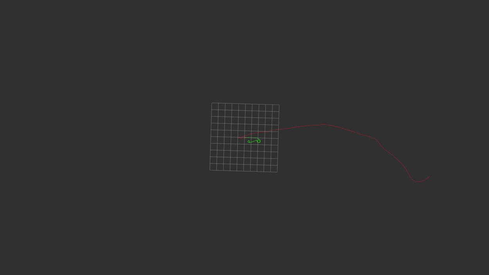
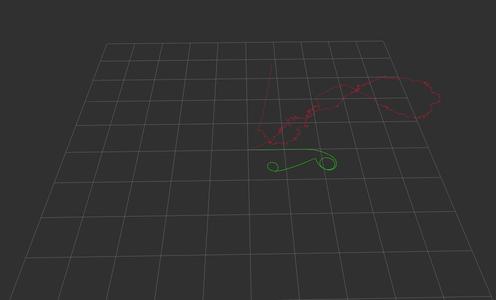

# Dead Reckoning Node
### Written by: Malcolm Benedict
### Last updated: 1/31/2026 
### Contact: mmbenedi@mtu.edu
This project implements a simple ROS2 node which calculates robot position by dead reckoning using velocity commands and IMU data. By using these two sources of data, the node demonstrates the limitations of dead reckoning based estimation, the role of noise and the difference between command data and recorded measurements.
## Instructions
1) First, generate a proper ROS2 workspace directory containing a /src subdirectory
2) In the root of the workspace run the following command: 
    ~~~ 
    $ ros2 pkg create --build-type ament_python dead_reckoning 
    ~~~

    This will generate the appropriate Python package named "dead_reckoning"
3) Place the "estimator_node.py" file into the "/dead_reckoning" directory generated within the package directory. The path should take the form: 
   ~~~
   /workspace_root/src/dead_reckoning/dead_reckoning/estimator_node.py
   ~~~
4) Next, locate the "setup.py" file at the root of the dead_reckoning package. Add the following within the "entry_points" list:
    ~~~
    'console_scripts': ['estimator = dead_reckoning.estimator_node:main'],
    ~~~
    This allows the node to be initialized from the command line.

5) ROS2 is structured such that nodes can be agnostic to the source of messages they subscribe to. These next steps will assume that messages will come from a pre-recorded bag file named "proj3". However, they could also come from real-world hardware, such as a turtlebot being controlled in real time via teleop. The source of the messages does not matter, so long as it provides appropriately formatted /cmd_vel and /imu messages. To use the bag file, place it in the root of the workspace.
6) In the root of the workspace, build the package with the following:
   ~~~
   $ colcon build
   ~~~
7) Source the workspace with 
   ~~~
   $ source install/setup.bash
   ~~~
8) Run the estimator node with the following command:
   ~~~
   $ ros2 run dead_reckoning estimator
   ~~~
   This should not produce any output yet.
9) Open a new terminal window, navigate to the root of the project workspace and source the terminal per step 7.
10) In this terminal, play the bag file with the following command:
    ~~~
    $ ros2 bag play proj3
    ~~~
    Now the estimator node should be publishing two path topics and two odometry topics.
11) To view these topics, open a new terminal, navigate to the root of the project workspace and source the terminal per step 7. 
12) Open rviz2 with the following command:
    ~~~
    $ rviz2
    ~~~
13) In rviz, change the "Fixed Frame" option to "odom"
14) Click the "Add" button in the bottom left, which should bring up a GUI to add a visualization.
15) Switch to the "By Topic" tab.
16) Select "/dead_reckoning/path" to visualize the path generated by integrating /cmd_vel data.
17) Repeat steps 14 through 16, with the "/imu_integration/path topic to visualize it as well.  It is recommended to change the color of the IMU data to make it easy to distinguish.
18) This will show the paths generated via both types of dead reckoning. The result should look like the following:
## Results
Two methods were attempted for the IMU data, one of which involved performing the coordinate transform on the acceleration data, and one of which involved performing it on the velocity data. Testing was somewhat hampered by apparent differences in output depending on whether or not rviz2 was open while the package was rebuild. The best performance was achieved with the velocity method, a linear acceleration scale of 0.1 and an angular velocity scale of 2.0. However this result was not able to be replicated, and so remains only a footnote. The path generated by the acceleration method is shown below. This is also the code on the main branch.

While the velocity result which closely matched the original was unable to replicated, another interesting result was discovered by accident, when only integrating the acceleration once. This output, which somewhat resembles the true path, is shown below.

The path generated from the /cmd_vel messages is in green. The path generated from the IMU data is in red.
## Discussion

It is immediately obvious that there is significant error in the path generated from the IMU data; assuming, for reasons which will be discussed shortly, that the /cmd_vel path is an accurate theoretical model. The IMU path is offset and has a noticeable scale difference. The two paths diverge immediately, with the IMU path appearing to have an incorrect initial heading. Additionally, as time progresses, it becomes apparent that the IMU path appears to be scaled up from the /cmd_vel path.

Both paths are generated via dead reckoning of discrete time integration of data. The /cmd_vel data provides a theoretical model for the robot's behavior, as it is a control signal, and does not have any noise. Noise is the main limitation of dead reckoning as an approach, as any error will accumulate over time because the system is not closed. While it works well for a signal such as the /cmd_vel data, which does not have any noise, the effects of noise on the IMU data are quite significant. In particular, because the IMU records acceleration data, error will accumulate in the velocity, in addition to the position and heading, resulting in particularly poor performance. Even with zero mean noise, where the acceleration error should eventually average out over time, the accumulated position and heading error will only accumulate.

This is not to say that the /cmd_vel method is a perfect representation of a robot's motion, only it's control signal. The actual robot is subject to the laws of physics, and takes time to accelerate, which the /cmd_vel measurement does not take into account, which represents a significant assumption. The other main assumption this data incorporated is that, as a skid-steer robot, it cannot move in its own y-axis. Additionally, a real robot will not be able to maintain a perfect speed, there will always be some error, however slight, in the size of the wheels the behavior of the encoders and the surface of the floor that leads to drift over time. Because of this, both approaches are inherently limited.

While the IMU data carries fewer assumptions about the motion of the robot, the noise and accumulated error limits its usefulness. This is why systems using IMU dead reckoning often incorporate a Kalman, or similar filter to reduce the impact of noise and take into account the known info. of the model provided by the input commands. Incorporating such a filter would likely improve the performance of a node like this one.